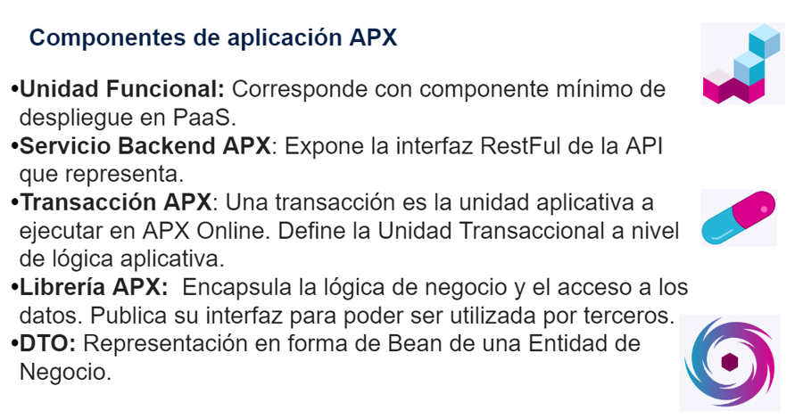

# EntornoAPX

## Descripción

Este proyecto contiene la implementación y pruebas de un servicio en Java, usando una base de datos para almacenar la información de un cliente mediante una inserción.

## Código para ejecutar en DBear

```sql
CREATE TABLE WIKJ."T_WIKJ_HAB_PRUEBAFINAL"(
    dni Number(5) NOT NULL PRIMARY KEY,
    nuip Number(10) NOT NULL UNIQUE,
    full_name VARCHAR(50),
    phone VARCHAR(15),
    address VARCHAR(30)
);

SELECT dni, nuip, full_name, phone, address FROM WIKJ.T_WIKJ_HAB_PRUEBAFINAL WHERE dni=:dni;

SELECT dni, nuip, full_name, phone, address FROM WIKJ.T_WIKJ_HAB_PRUEBAFINAL WHERE dni=:dni;
INSERT INTO WIKJ.T_WIKJ_HAB_PRUEBAFINAL (DNI, NUIP, FULL_NAME, PHONE, ADDRESS) VALUES(:dni, :nuip, :full_name, :phone, :address);
```

## WIKJ

Se utilizó el código `777` para `cpn` y `778` para el `parent`.

## Pruebas de ejecución

Se utilizó el siguiente JSON:

```json
{
  "dtoIn": {
    "dni": 5,
    "nuip": 333,
    "full_name": "Angel Cruz",
    "phone": "55491234",
    "address": "calle allende"
  }
}
```

### Ejecución 1

.png)

Se puede observar cómo se hizo la inserción en la base de datos y cómo se registró correctamente en Postman.

### Ejecución 2

.png)

Aquí se observa una segunda prueba.

### Ejecución 3

.png)

Aquí se observa una tercera prueba.

### Ejecución 4

.png)
y se observa que se ingreso el mismo nuip y por ello dio error 

### Ejecución 5

.png)
se muestra una inserccion mas y correcta con una nuip no utilizada


### Supuestos 

-no se especifico como se tenia que hacer la validacion de nuip para que no se repitiera por ello desde la base de datos se le asigna un NOT NULL Y UNIQUE al nuip para que no se repita y esto hace que no haya nuips repetidos
-La prueba pide tener un DTO de salida y otro de entrada, ambos pasando obligatoriamente por la librería de negocio, si es la capa Bussines es de ASO y en los archivos encontramos la siguiente imagen 

donde especifica que el DTO es la representacion del bean de una entidad de negocio por lo cual cumple con ello

## Tecnologías Utilizadas

- **Java 1.8**
- **Docker**
- **IntelliJ IDEA**
- **Postman**
- **Git y GitHub**
- **DBear**
- **Maven 3.5.3**

## Autor

**Angel Sierra**

